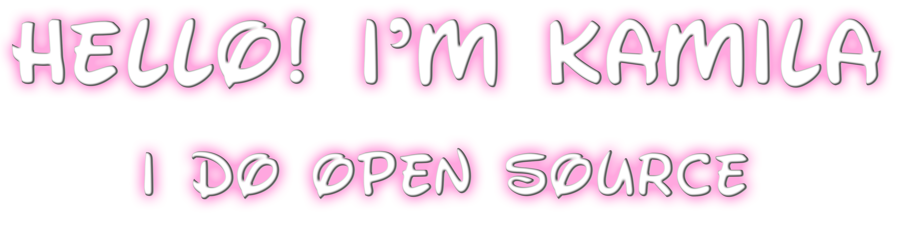

</a>

  Eu ❤️ resolver grandes desafios com tecnologia.
    
  Sou <strong>Desenvolvedora Full Stack (Pleno)</strong> focada em produtos web.
    
  <strong>Back-end:</strong> experiência com <strong>Node.js</strong> (APIs REST, integrações, autenticação) e
  evolução em <strong>.NET</strong> — fortalecendo <strong>C# / ASP.NET Core</strong> para criação de APIs e serviços.
   
  <strong>Front-end:</strong> <strong>React + Angular + TypeScript</strong>, componentização, <strong>styled-components</strong>,
  responsividade e boas práticas de UI/UX.
   
  <em>Crio interfaces interativas com efeito de digitação (“typewriter”) usando <strong>react-typist</strong>, com layout inspirado em máquina de escrever.</em>

 

 
 &nbsp;
 &nbsp;

## My Skills

#### Main Stack:

&nbsp;
&nbsp;
&nbsp;
&nbsp;
&nbsp;
&nbsp;

#### Secondary Stack:

&nbsp;
&nbsp;

#### Studying in this moment:

&nbsp;
&nbsp;

#### Databases:

&nbsp;
&nbsp;
&nbsp;

#### Workstation Tools:

&nbsp;
&nbsp;
&nbsp;

&nbsp;
&nbsp;

## Contacts:

 

 
